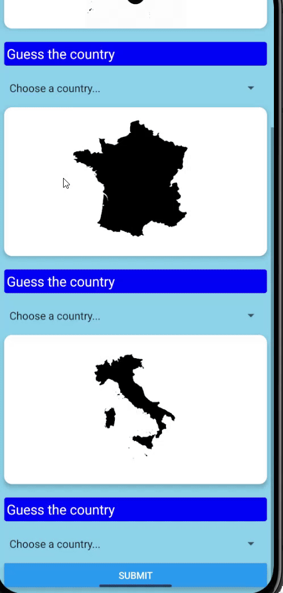

# 🇺🇳 Guess the Country — Mobile Quiz App

A simple and fun React Native quiz game where users try to identify a country based on an image.  
If the guess is correct — you win! If not — try again!

---

## 🌍 Overview

**Guess the Country** is a beginner-friendly mobile quiz app built using **React Native (Expo)**.  
The app shows an image of a country or landmark, and the user must choose the correct answer from a dropdown list.

The main goal of this project is to practise:

- Components & props
- Using images in React Native
- Managing state
- Handling user interactions
- Basic UI organisation

It is lightweight, easy to understand, and suitable for learning the fundamentals of app development.

---

## ⭐ Key Features

- 🖼️ Displays a photo related to a country
- 🎯 User selects an answer from a dropdown
- 🟢 Correct guess → *Success message*
- 🔴 Wrong guess → *Try again / Failure message*
- 💾 Packed as an Android APK
- ⚡ Fast, simple and intuitive UI
- 📱 Works on both real devices and emulators

---

## 🎞️ App Preview (GIF)

  

---

## 🎥 Video Walkthrough
*(Replace with your real link)*  
https://www.youtube.com/watch?v=somevideoplaceholder

---

## 📱 Download the App
Install the Android version here:

👉 **[Download APK](./assets/l08.apk)**

> You may need to enable **“Install from Unknown Sources.”**

---

## 🛠️ Tech Stack

| Technology | Purpose |
|-----------|---------|
| **React Native** | Base framework |
| **Expo** | Running & building the app easily |
| **JavaScript (ES6)** | Logic & state management |
| **Picker Dropdown** | User answer selection |
| **React Hooks** | Managing state (`useState`) |

---

## 📂 Project Structure

